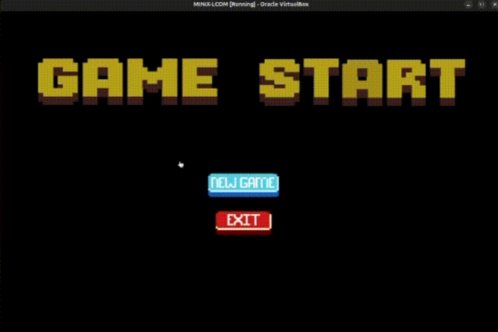
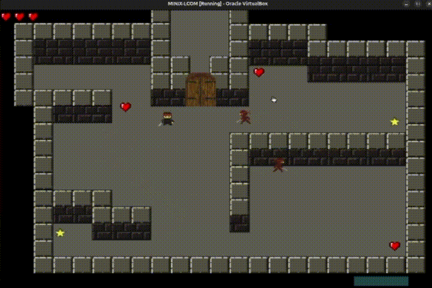
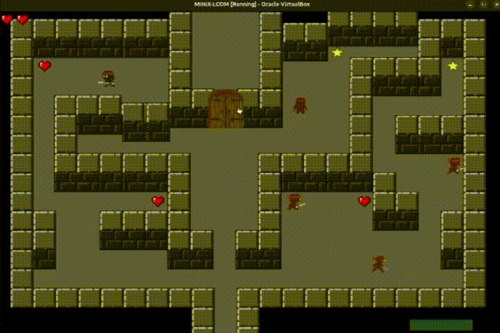
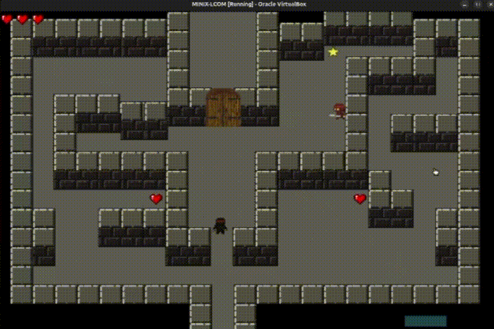
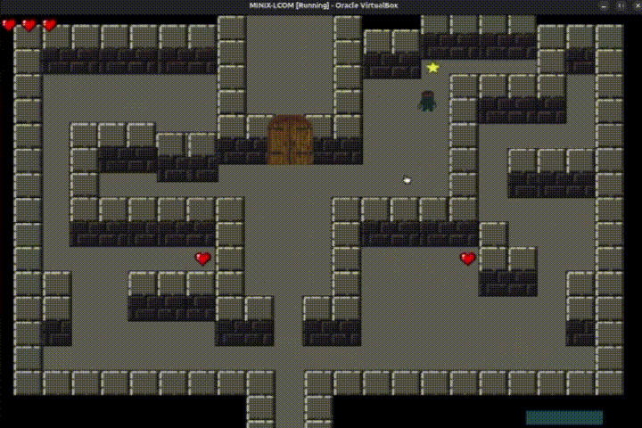
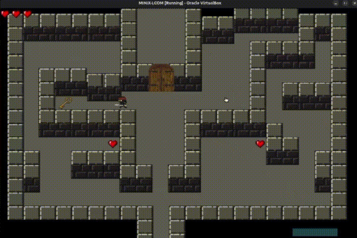
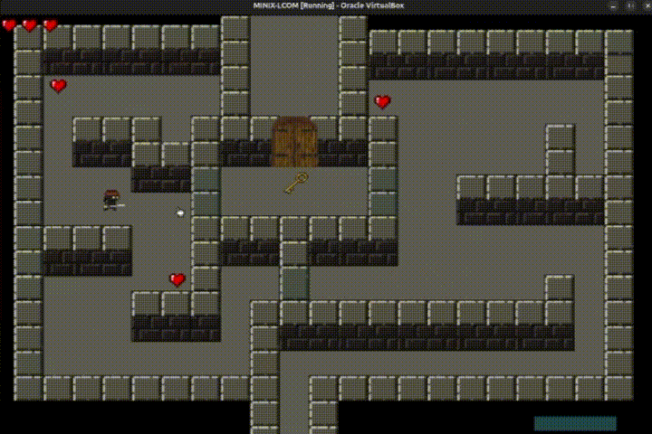
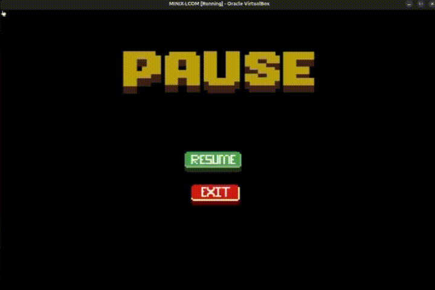
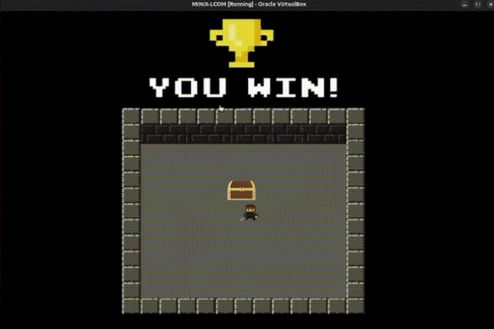

# LCOM Project

This project, developed in Minix3, implements the I/Os drivers timer, keyboard, mouse and video to create a labyrinth based game where the player has to go through 3 levels.
In this game the player navigates through a room filled with enemies, obstacles and collectibles like hearts and stars.
The player can move and interact with the environment to overcome challenges, like killing the monsters, catching the stars and get the key to open the door to the next level, and use speed to go through special walls.
There is also a life system feature that allows the player to catch more lives if they lose one by colliding with monsters or bombs.

##

LCOM Project for group GRUPO_2LEIC06_4.

Group members:

1. &lt;Catarina&gt; &lt;Bastos&gt; (&lt;up202307631@up.pt&gt;)
2. &lt;Filipe&gt; &ltSolha&gt; (&lt;up202306528@up.pt&gt;)
3. &lt;Nuno&gt; &ltCosta&gt; (&lt;up202305503@up.pt&gt;)
4. &lt;Vasco&gt; &ltGonçalves&gt; (&lt;up202305513@up.pt&gt;)

## Features

- **Game Start Menu**

  

<i>Includes buttons to start a new game or exit the game.</i>

 

- **Ninja's Weapon**

  

<i>Allows the player to use the cursor to point to the enemies and by clicking on the right button it shots a blade to kill them.</i>

 

- **Lives System**

  

<i>The player starts with three lives and by being attack by an enemy or a bomb loses one of them, but they are able to regain their lives by catching the hearts scattered in the level.</i>

 

- **Bombs**

  

<i>There are secret bombs scattered through the level that are activated by the ninja when they step on it and if the ninja stays there during the bomb's explosition they lose a life.</i>

 

- **Going to the next level**

  

  

<i>To allow the player to go to the next level they need to catch all the starts that appear in game, and when the final star is catched, a key appears and only with this key can the player go to the door and by clicking on it with the left cursor button they can get to the next level.</i>

 

- **Speed Ability**

  

<i>By pressing the spacebar in the keyboard the player gains speed which is the only way that they can go through some special walls featured in the final level of the game</i>

 

- **Pause Menu**

  

<i>Includes buttons to resume or exit the game.</i>

 

- **Win Menu**

  

<i>When the player finishes all the levels they get to the win menu where by pressing the right button in the cursor while standing over the chest they can start a new game or exit.</i>

 

## References

- **Treasure Chest (`reward.xpm`)**  
Created by UndineH6  
Licensed under [CC0 1.0 Universal (Public Domain Dedication)]  
(https://creativecommons.org/publicdomain/zero/1.0/)  
Source: [OpenGameArt - Chest #5] (https://opengameart.org/content/chest-5)  
- **Castle Door (`door.xpm`)**  
  Created by Tuomo Untinen  
  Licensed under [Creative Commons Attribution 3.0 (CC BY 3.0)]  
(https://creativecommons.org/licenses/by/3.0/)  
Source: [OpenGameArt - Castle Door] (https://opengameart.org/content/castle-door)  
- **Explosion (`explosion1/2/3/4/5/6.xpm`)**  
  Created by Sogomn  
  Licensed under [CC0 1.0 Universal (Public Domain Dedication)]  
(https://creativecommons.org/publicdomain/zero/1.0/)  
Source: [OpenGameArt - Explosion #3] (https://opengameart.org/content/explosion-3)  
- **Heart Pixel Art (`heart.xpm`)**  
  Created by Flixbererry Entertainment   
  Licensed under [Creative Commons Attribution 3.0 (CC BY 3.0)]  
(https://creativecommons.org/licenses/by/3.0/)  
Licensed under [Creative Commons Attribution 4.0 (CC BY 4.0)]  
(https://creativecommons.org/licenses/by/4.0/)  
  Source: [OpenGameArt - Heart Pixel Art] (  
(https://opengameart.org/content/heart-pixel-art)  
- **Key Icons(`key.xpm`)**  
  Created by BlizmasterStudios   
  Licensed under [Creative Commons Attribution 4.0 (CC BY 4.0)](https://creativecommons.org/licenses/by/4.0/)  
  Source: [OpenGameArt - Key Icons] (  
(https://opengameart.org/content/key-icons)  
- **Ninja[Animated] (`knife.xpm`)**  
  Created by DezrasDragons   
  Licensed under [CC0 1.0 Universal (Public Domain Dedication)]  
  Source: [OpenGameArt - Ninja[Animated] (  
(https://opengameart.org/content/ninja-animated)  
- **Ninjas/ Monsters/ Speed Ninjas(`ninja-*.xpm/monster-*.xpm/ninja-speed-*.xpm`)**  
  Created with [Sora by OpenAI](https://openai.com/sora)   
  Usage permitted under [OpenAI’s Terms of Use ](https://openai.com/policies/terms-of-use)  
  Source: [OpenAI - Sora  ](https://openai.com/sora)
